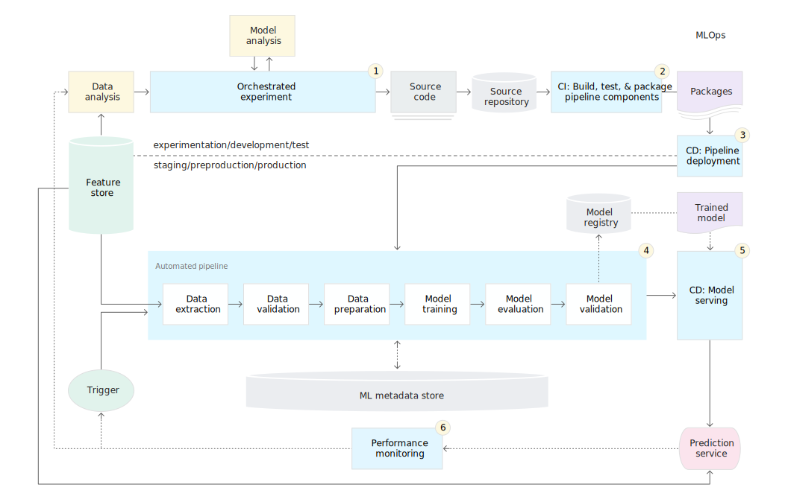

# 敏捷建模：算力-算法-灰度

关键词：Computing Force、混沌、信息流、SVI

2021.10.20

苏锦华

Available at https://github.com/SmartDataLab/CF-Share

Written by Marp and Mermaid in Markdown

---

# 厨房、皮衣与矿池

- 游戏党与年度最佳投资


---

# 算力

- Computing Performance
- GeForce(Geometry Force) Nvida GPU


---

# 复杂问题建模  

- Algebra - Geometry
- Analytic - Graphic
- Linear - Nonlinear
- Breadth - Depth


---


# 信息流与混沌

- 数据库发展
RDBMS --> NoSQL
- 计算引擎的发展
Map-Reduce&Resilient Distributed Dataset
- 建模与假设
Attention is all you need
- 模型求解
BackProp Hinton & Lecun
Pretrain Finetune
Stochastic Varational Inference


---

# 生产实际问题

- Continous Machine Learning(concept from CI&CD)
- Data Transfer Problem(Model Degeneration)
- AB-test & Gray-test（hypothesis test & PSM-DID）



---

# 趋势：云原生与微服务

- 容器化技术（Docker K8S）
- 美团的GPU集群出售
- Yale NLP相关的暑研(AWS)


---

# 贝叶斯方法在深度学习

- 随机项$\epsilon$在传统统计模型的重要意义($\epsilon  \perp X$ )：
	+ confidence interval
	+ p value
- Interpretable methods in ML(Virance-Bias: Data Quality)
	+ data perturbation(data augmentation)
	+ model parameter randomness(random seed)
	+ hyperparameter perturbation(NAS)
- Hybird: Stochastic Model + Neural Network


---

# Stochastic Variational Inference

- Notation: oberservation $x$, model parameter $\theta$ latent variables $z$

$$
p_{\theta}(\mathbf{x}, \mathbf{z})=p_{\theta}(\mathbf{x} \mid \mathbf{z}) p_{\theta}(\mathbf{z})
$$

- Parameter Learning Target: log evidence & Latent Posterior

$$
\log p_{\theta}(\mathbf{x})=\log \int d \mathbf{z} p_{\theta}(\mathbf{x}, \mathbf{z})
$$


$$
p_{\theta_{\max }}(\mathbf{z} \mid \mathbf{x})=\frac{p_{\theta_{\max }}(\mathbf{x}, \mathbf{z})}{\int d \mathbf{z} p_{\theta_{\max }}(\mathbf{x}, \mathbf{z})}
$$

---

# SVI in Pyro cont.

- Intuition: Guide $q_{\phi}(\mathbf{z}) \sim p_{\theta_{\max }}(\mathbf{z} \mid \mathbf{x})$

```python
def model():
    pyro.sample("z_1", ...)
def guide():
    pyro.sample("z_1", ...)
```

- Optimization Target: Evidence Lower Bound (ELBO): MM method

$$
\mathrm{ELBO} \equiv \mathbb{E}_{q_{\phi}(\mathbf{z})}\left[\log p_{\theta}(\mathbf{x}, \mathbf{z})-\log q_{\phi}(\mathbf{z})\right]
$$

$$
\log p_{\theta}(\mathbf{x})-\mathrm{ELBO}=\mathrm{KL}\left(\mathrm{q}_{\phi}(\mathbf{z}) \| \mathrm{p}_{\theta}(\mathbf{z} \mid \mathbf{x})\right)
$$

---

# A Simple Example：toss the coin

```python
def model(data):
    # 先验知识，正面向上的概率为 1/2
    alpha0 = torch.tensor(10.0)
    beta0 = torch.tensor(10.0)
    f = pyro.sample("latent_fairness", dist.Beta(alpha0, beta0))
    for i in range(len(data)):
        pyro.sample("obs_{}".format(i), dist.Bernoulli(f), obs=data[i])
```
```python
def guide(data):
    alpha_q = pyro.param("alpha_q", torch.tensor(15.0),
                         constraint=constraints.positive)
    beta_q = pyro.param("beta_q", torch.tensor(15.0),
                        constraint=constraints.positive)
    pyro.sample("latent_fairness", dist.Beta(alpha_q, beta_q))
```

---


# Example: Variational Auto-Encoder


---

```python
class VAE(nn.Module):
    def __init__(self, z_dim=50, hidden_dim=400, use_cuda=False):
        super(VAE, self).__init__()
        self.encoder = Encoder(z_dim, hidden_dim)
        self.decoder = Decoder(z_dim, hidden_dim)
        if use_cuda:
            self.cuda()
        self.use_cuda = use_cuda
        self.z_dim = z_dim
    # define the model p(x|z)p(z)
    def model(self, x):
        pyro.module("decoder", self.decoder)
        with pyro.plate("data", x.shape[0]):
            z_loc = x.new_zeros(torch.Size((x.shape[0], self.z_dim)))
            z_scale = x.new_ones(torch.Size((x.shape[0], self.z_dim)))
            z = pyro.sample("latent", dist.Normal(z_loc, z_scale).to_event(1))
            loc_img = self.decoder.forward(z)
            pyro.sample("obs", dist.Bernoulli(loc_img).to_event(1), obs=x.reshape(-1, 784))
    def guide(self, x):
        pyro.module("encoder", self.encoder)
        with pyro.plate("data", x.shape[0]):
            z_loc, z_scale = self.encoder.forward(x)
            pyro.sample("latent", dist.Normal(z_loc, z_scale).to_event(1))
    def reconstruct_img(self, x):
        z_loc, z_scale = self.encoder(x)
        z = dist.Normal(z_loc, z_scale).sample()
        loc_img = self.decoder(z)
        return loc_img
```


---

# More Popular Stochastic Model

- Deep Generative Models

- Discrete Latent Variables

- Reinforcement Learning：Policy Gradient

- Previous Major Application 
	+ Time Series
	+ Gaussian Processes: Kalman Filter
	+ Epidemiology
	+ Space Trace

---

# Technical Trend or Hot topic

- Batch、Batch and Batch
	- More Efficient Stochastic Gradient(Dropout and Oneshot)
	- Federated Learning (Distributed)
	- Multi-Stage Transfer Learning
- Hyper、Hyper and Hyper
	- Neural Architecture Search
- Multi、Multi and Multi
	- Pretrained Model(self supervised task) and Transfer Learning
	- Multi-Source, Multi-Modal: Auto Feature Engineering

---


# Online Reference

https://zhuanlan.zhihu.com/p/63276887

https://pyro.ai/examples/svi_part_i.html

https://zhuanlan.zhihu.com/p/150190166

http://sofasofa.io/forum_main_post.php?postid=1005437

http://yann.lecun.com/exdb/publis/pdf/lecun-98b.pdf

https://www.zhihu.com/question/264189719

---

<!-- _class: lead -->


#  Thanks